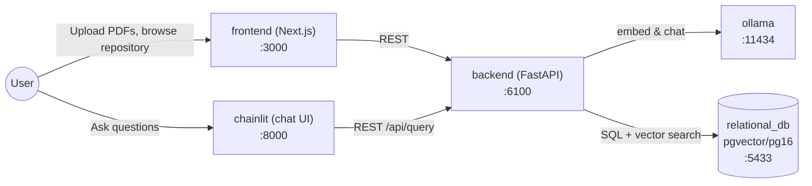
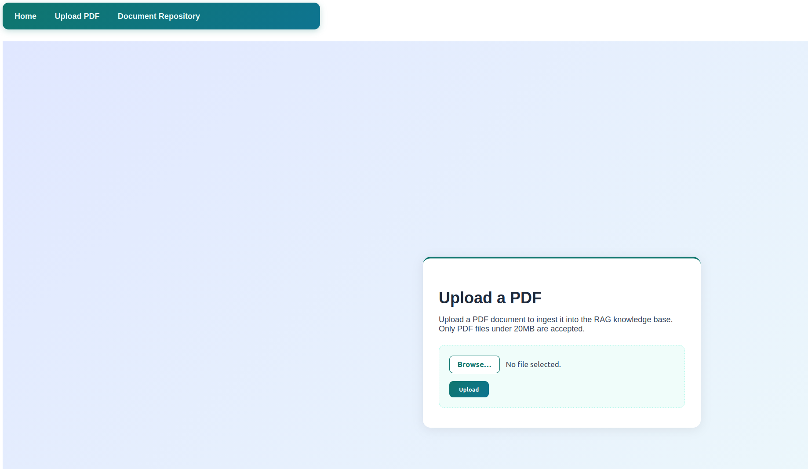
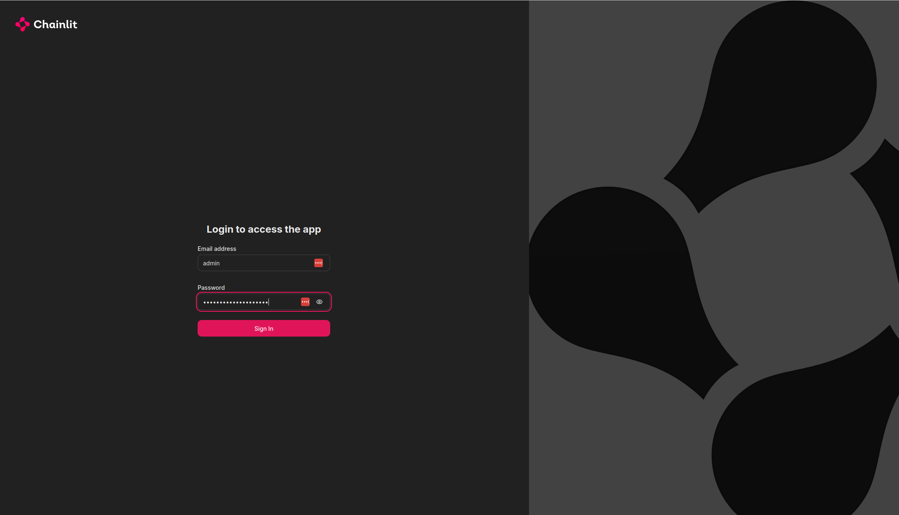
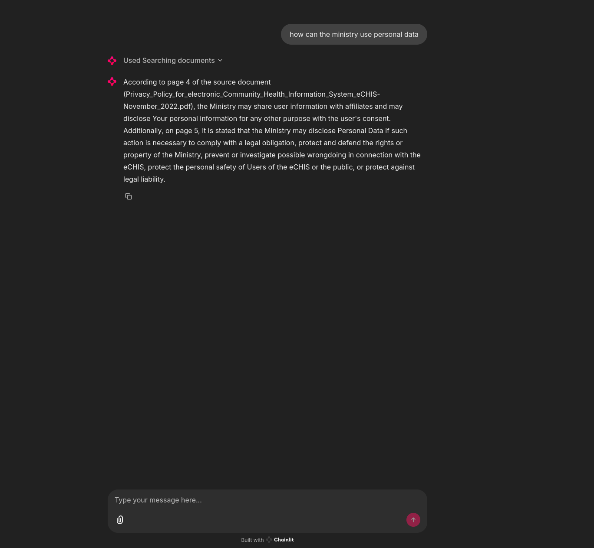
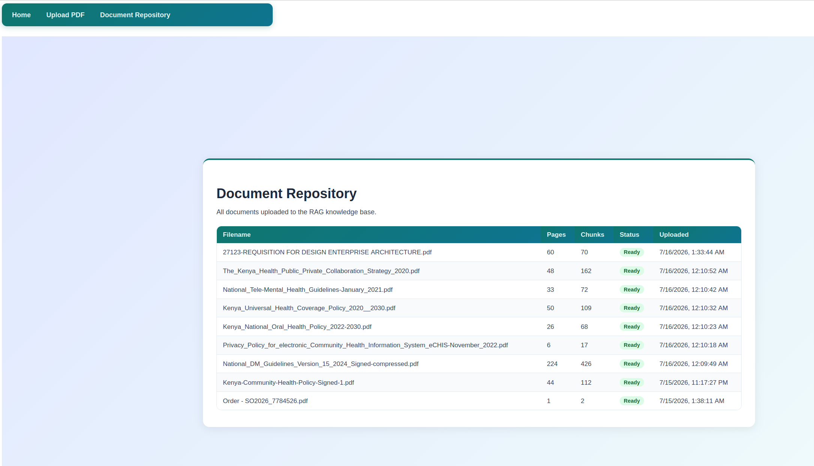

## Last Mile Health — Senior Full-Stack Engineer, AI & Digital Health Practice Assessment

A self-hosted Retrieval-Augmented Generation (RAG) application: upload PDF documents, ask
questions about them in a chat interface, and get answers grounded in the ingested content
with cited sources — no document content ever leaves the local stack.

Production deployment plan: see [`docs/DEPLOYMENT.md`](docs/DEPLOYMENT.md) and
[`docs/DEPLOYMENT_RATIONALE.md`](docs/DEPLOYMENT_RATIONALE.md).

---

### 1. Overview

Users upload PDFs through a Next.js page, which are chunked, embedded, and stored as vectors
in Postgres/pgvector. A Chainlit chat UI (or the Next.js frontend) sends questions to a FastAPI
backend, which embeds the question, retrieves the most similar chunks via cosine similarity,
and asks a local Ollama chat model to answer using only that retrieved context — so answers are
grounded in your own documents and cite the source filename and page number.

### 2. Architecture



| Service | Role | Ollama model used |
|---|---|---|
| `frontend` | Next.js — home/instructions, PDF upload, document repository | — |
| `chainlit` | Chat UI, calls the backend's `/api/query` over HTTP | — |
| `backend` | FastAPI — ingestion pipeline (`/documents/upload`, `/documents`) and RAG query (`/api/query`, `/api/health`) | calls both models below |
| `relational_db` | PostgreSQL + pgvector — stores document/chunk metadata and embeddings | — |
| `ollama` | Serves the local models | **`all-minilm`** (384-dim embeddings, ingestion + query) and **`llama3.2`** (answer generation) |

Both models are declared in `docker-compose.yaml` and pulled automatically the first time the
`ollama` container starts (no manual `ollama pull` needed).

### 3. Prerequisites

- Docker Engine 24+ and Docker Compose v2.20+ (`docker compose version`)
- **Disk:** ~10 GB free — `llama3.2` (~2 GB) + `all-minilm` (~50 MB) plus the Postgres, Python,
  and Node images
- **RAM:** at least 8 GB available to Docker. `llama3.2` (3B, Q4_K_M quantization) runs on CPU;
  no GPU is required locally (see `docs/DEPLOYMENT.md` for a GPU scaling path in production)
- Ports `3000`, `6100`, `8000`, `5433`, and `11434` free on the host
- A `.env` file in the repo root — copy the template and fill in real values:

  ```sh
  cp .env.example .env
  ```

  | Variable | Used by | Notes |
  |---|---|---|
  | `CHAINLIT_AUTH_SECRET` | `chainlit` | Signs Chainlit's session cookie. Generate one with `python3 -c "import secrets; print(secrets.token_hex(32))"` |
  | `CHAINLIT_USERNAME` | `chainlit` | Login username for the chat UI |
  | `CHAINLIT_PASSWORD` | `chainlit` | Login password for the chat UI |

  Postgres, Ollama, and CORS settings are set directly as `environment:` values in
  `docker-compose.yaml` (not templated from `.env`) — see that file if you need to change hosts,
  ports, or model names.

### 4. Running locally — step by step

1. **Clone and enter the repo:**
   ```sh
   git clone <your-fork-url>
   cd Senior-Engineer-AI-Digital-Health-Skills-Assessment
   ```
2. **Configure environment:**
   ```sh
   cp .env.example .env
   # then edit .env and fill in CHAINLIT_AUTH_SECRET / CHAINLIT_USERNAME / CHAINLIT_PASSWORD
   ```
3. **Build and start every service:**
   ```sh
   docker compose -p assessment up -d --build
   ```
   This also pulls `all-minilm` and `llama3.2` inside the `ollama` container on first boot —
   no separate `ollama pull` command is needed.
4. **Wait for readiness.** First boot downloads ~2 GB of models; tail the logs until you see
   both pulls finish:
   ```sh
   docker compose -p assessment logs -f ollama
   ```
5. **Verify it works:**
   ```sh
   curl http://localhost:6100/api/health
   # {"status":"ok"}
   ```
   Then open [http://localhost:3000/upload](http://localhost:3000/upload), upload a PDF, wait
   for `status: ready`, and ask a question about it in the chat UI at
   [http://localhost:8000](http://localhost:8000) (or via `curl -X POST
   http://localhost:6100/api/query -H 'Content-Type: application/json' -d
   '{"question":"..."}'`).
6. **URLs:**

   | Service | URL |
   |---|---|
   | Frontend (home / upload / document repository) | http://localhost:3000 |
   | Chainlit chat UI | http://localhost:8000 |
   | Backend API docs (Swagger) | http://localhost:6100/docs |

7. **Stop everything:**
   ```sh
   docker compose -p assessment down
   ```

### 5. Running the tests

**Backend — unit suite** (fast, no external services; mocks Ollama and the pgvector layer):
```sh
cd backend
python3 -m venv .venv && ./.venv/bin/pip install -r requirements-test.txt
./.venv/bin/python -m pytest tests/unit -m unit
# 53 passed
```
Or from the repo root: `make test-backend-unit`.

**Backend — integration suite** (hits a real Postgres/pgvector and a real Ollama; requires
`docker compose up -d relational_db ollama` first). It creates its own `rag_test` database on
the same Postgres server so it never touches documents you've already ingested:
```sh
docker compose -p assessment up -d relational_db ollama
cd backend
./.venv/bin/python -m pytest tests/integration -m integration
# 6 passed
```
Or from the repo root: `make test-backend-integration`. If Ollama or Postgres are mapped to
non-default host ports, point the suite at them with `TEST_OLLAMA_HOST` / `TEST_POSTGRES_PORT`
(see `backend/tests/integration/conftest.py` for the full list of `TEST_*` overrides).

**Frontend — unit suite** (Vitest + React Testing Library, mocked `fetch`, jsdom):
```sh
cd frontend
npm install
npm run test        # single run — 16 passed
npm run test:watch  # watch mode
```
Or from the repo root: `make test-frontend`. Requires Node 20+ (matches the version the
frontend's Dockerfile builds with).

### 6. Screenshots / Example outputs

Services built and running via `docker compose -p assessment up -d --build`:


*The Upload PDF page — drag/select a PDF under 20MB and ingest it into the knowledge base.*


*Chainlit's password-protected login screen, guarding the chat UI.*


*Asking a question in the chat UI — the answer cites the source document and page number,
retrieved from the ingested PDF via pgvector similarity search.*


*The Document Repository page, listing every ingested PDF with page/chunk counts and status.*

### 7. Troubleshooting

- **Chat answers are generic / not grounded, or `/api/query` returns the "no ingested
  documents" fallback:** no document has finished processing yet. Check
  `GET http://localhost:6100/documents` — the `status` field must be `ready`, not
  `processing` or `failed`.
- **First query is very slow (10–30s+):** expected on a cold start — Ollama loads `llama3.2`
  into memory on first use after container start or idle timeout. Subsequent requests are
  much faster while the model stays warm.
- **`ollama` container fails to start / model pull never finishes:** confirm outbound network
  access from the container, then re-check progress with
  `docker compose -p assessment logs -f ollama`. Models are pulled by the container's startup
  script, not baked into the image.
- **Port already in use (`bind: address already in use`), especially `11434`:** something else
  on the host (often a native Ollama install) is already bound to that port. Either stop it, or
  change the host-side port in the `ports:` mapping for that service in `docker-compose.yaml`
  (e.g. `"11435:11434"`) and use the new port in any commands/env vars that reference it.
- **pgvector extension or tables missing:** shouldn't happen with the bundled
  `pgvector/pgvector:pg16` image — the backend's `init_db()` creates the `vector` extension and
  tables idempotently on startup. If you've pointed the backend at a *different*, pre-existing
  Postgres instance, make sure the `vector` extension is installable there (`CREATE EXTENSION
  vector` requires the pgvector package on that server).

---

### Submission notes

This repository was built from a starter template for the Last Mile Health Senior Full-Stack
Engineer, AI & Digital Health practice assessment. Commit history reflects incremental,
feature-by-feature development.
